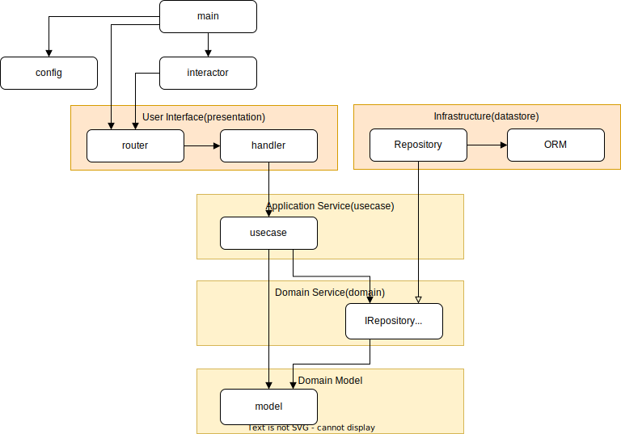

# 開発者向けドキュメント

## アーキテクチャ図



## ディレクトリ構成
```
├── domain
│   ├── model              // ドメインモデルを定義する。
│   │
│   ├── repository         // Infrastructure で使用される Interface を定義する。
│   │                      
│   │
│   └── common             // ドメイン共通な構造体定義用。
│
├── infrastructure         // Adapter
│   └──  persistence       // domain/repository の実装を記述
│
├── interactor             // DIコンテナ
│
├── presentation           // UI
│   └── http
│       └── echo
│           ├── handler    // リクエストパラメータのバリデーション
│           ├── middleware // Echo の設定
│           └── router     // パスルーティング定義
│
├─── usecase               // データ変換や固有のロジックを実装
│                          
├── config                 // コンフィグ
│
└── docs                   // ドキュメント管理
```

## API定義
```/docs/openapi.yaml```を参照

## 本リポジトリのDB構成

[スキーマ情報](/docs/dbdoc/README.md)


## エラー設計
```json
{
	"code": "[prefix] {Error Status}",
	"message": "{Error Code or Error Message}",
	"detail": "{Error Details or Details}"
}
```

上記のエラーメッセージの形式はユーザ認証・データ流通システムにて発生するメッセージのテンプレートになります。連携層システムにて発生する場合はメッセージ内容が異なります。

### prefixの内容
prefixにはエラーが発生したシステム名が記入されます。現在はprefixには以下が入ります。

- auth：ユーザ認証システムでエラーが発生した場合
- dataspace：データ流通システムでエラーが発生した場合
- 上記以外、連携層システムでエラーが発生した場合

### エラーコード
|Status Code |Error Status |Error内容 |
|:-----|:-------|:----|
|400 |BadRequest |一般的なメッセージでリクエスト自体に問題があることを示します。<br>[Invalid request parameters] <br> リクエストに関する異常の際のmessage <br>[Validation failed] <br> リクエストデータが特定の検証ルールに適合しない場合などのアプリケーション内でのエラーのmessage |
|401 |Unauthorized |リクエストが認証を必要とし、提供された認証情報が無効または提供されていないことを示します。<br>[Invalid credentials]<br>認証情報が不一致の際のmessage<br>[Authentication required]<br>必要としている認証情報が欠落している場合のmessage<br>[Invalid or expired token]<br>トークンが無効または破損している場合に使用されるmessage |
|403 |AccessDenied |クライアントがリソースへのアクセスを拒否されたことを示します。<br>[You do not have the necessary privileges]<br>APIキーがない場合に表示されるmeaage<br>[Invalid Key]<br>APIKeyが不正の場合に表示されるmessage|
|404 |NotFound |要求されたリソースが存在しないことを示します。<br>[Endpoint Not Found]<br>指定されたエンドポイントが存在しない場合に使用されるmessage |
|500 |InternalServerError |[Unexpected Error Occurred]<br>バックエンドのサーバーサイドでErrorが発生している場合 |
|503 |ServiceUnavailable |[Service Unavailable]<br>その他予期せぬErrorが発生する場合 |

## ユニットテストの考え方
- `go test` コマンドを実行し、任意の環境でユニットテストが自動で実行されるようにしておく。
- データの入力をテストするため、handler層でのValidationテストを実装する。
- 各レイヤにおけるユニットテストの観点
  - handler 層
    - バリデーションチェックが想定どおりかを確認
    - 正常系および異常系のテストを記述する
  - usecase 層
    - モデルの変換処理が正しいかを確認
- 本リポジトリ公開時点では、ユニットテストでカバーされていないコード範囲が存在する。
- infrastructure\persistence\datastore内のユニットテストを実行するためにCGOを有効とする必要がある。そのため、Windows端末の場合は別途MinGWをインストールしておくこと。

## 現在アプリケーションで利用しているOSS

|Name                                        |Version |Notes|
|:-------------------------------------------|:-------|:----|
|golang                                      |1.22||
|golangci-lint                               |1.56.2||
|goreturns                                   ||go install|
|[mockery](https://vektra.github.io/mockery/)|v2.42.3||
|make                                        |GNU make 3.81||
|docker                                      |-||
|docker-compose                              |-||

※導入されているOSS一覧は`go.mod`内に記述

## 現在アプリケーションで利用しているMW
|Name                                        |Version |Notes|
|:-------------------------------------------|:-------|:----|
|postgres                                    |15.x|postgresのバージョンはGCPが提供しているCloudSQLでサポートするv15系のバージョンを参照している|
|Keycloak                                    |25.x||
