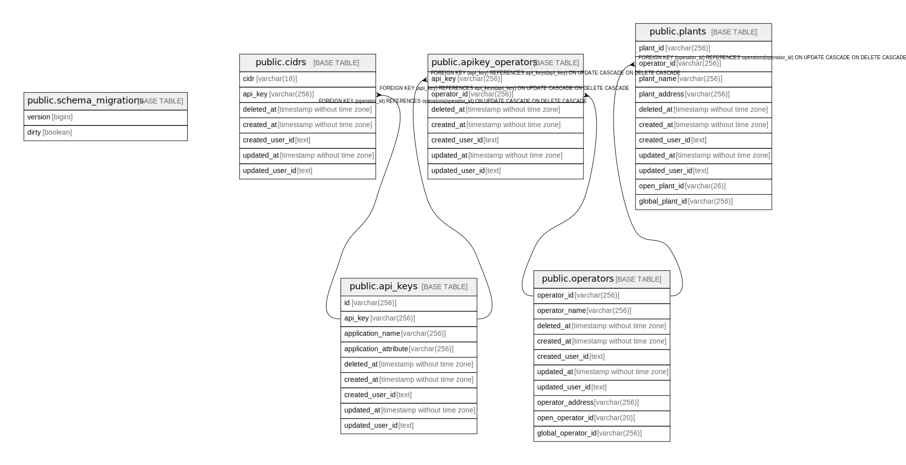

# dhlocal

## Tables

| Name | Columns | Comment | Type |
| ---- | ------- | ------- | ---- |
| [public.schema_migrations](public.schema_migrations.md) | 2 |  | BASE TABLE |
| [public.api_keys](public.api_keys.md) | 9 | APIKEYテーブル | BASE TABLE |
| [public.cidrs](public.cidrs.md) | 7 | CIDRテーブル | BASE TABLE |
| [public.operators](public.operators.md) | 10 | 事業者テーブル | BASE TABLE |
| [public.apikey_operators](public.apikey_operators.md) | 7 |  | BASE TABLE |
| [public.plants](public.plants.md) | 11 | 事業所テーブル | BASE TABLE |

## Relations

---

> Generated by [tbls](https://github.com/k1LoW/tbls)
